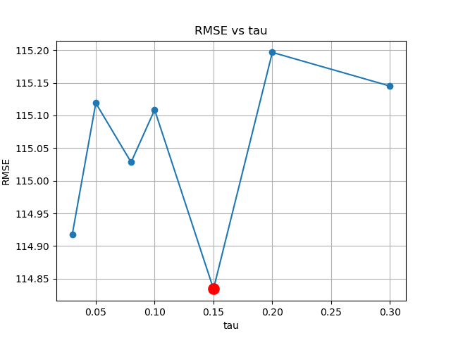
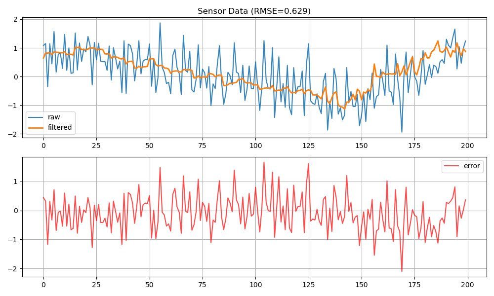
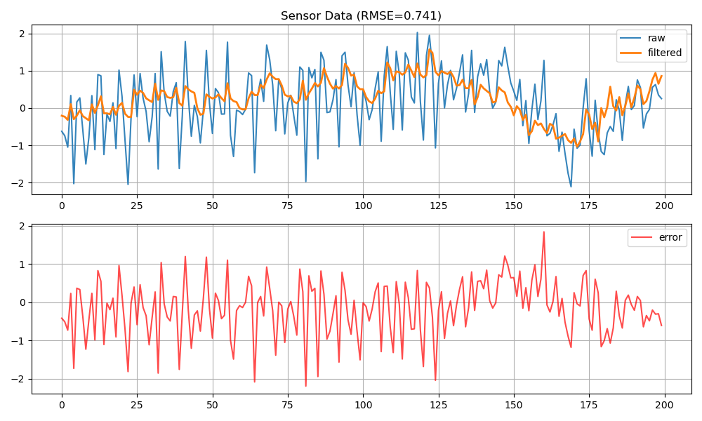
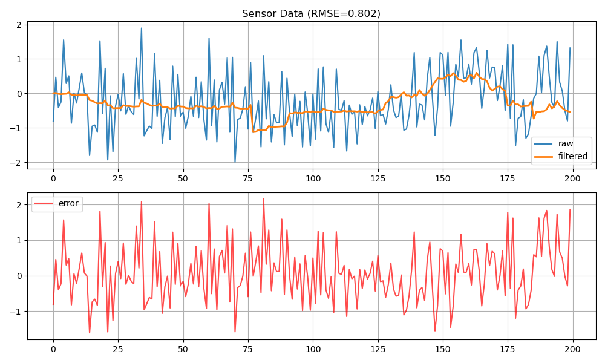

# ROS2 Sensor Pipeline

ROS2を用いてセンサーデータの生成・フィルタリング・可視化・評価までを一貫して行うパイプラインを構築しました。

---

## ■ 概要

ノイズを含むセンサーデータに対して一次遅れフィルタ（EMA）を適用し、  
可視化およびRMSEによる定量評価を通して最適なパラメータ（tau）を検証します。



---

## ■ ディレクトリ構成
```
ros2-sensor-pipeline/  
├ data/  
│ ├ result_tau_*.png         # 各tauの時系列グラフ  
│ ├ rmse_vs_tau.png          # RMSE vs tau グラフ  
│ └ experiment_results.csv   # RMSE集計  
│  
├ src/  
│ ├ sensor_pipeline_cpp      # センサ & フィルタノード（C++）  
│ ├ sensor_pipeline_py       # 可視化ノード（Python）  
│ └ sensor_pipeline_launch   # launchファイル  
│  
├ sweep_tau.py               # パラメータスイープ実験  
├ plot_rmse.py               # RMSEグラフ生成  
└ run_all.py                 # 全自動実行スクリプト  
```
---

## ■ システム構成

```
SensorNode (C++)
↓
生データ出力（/sensor/raw）
↓
FilterNode (C++)
↓
フィルターデータ出力（/sensor/filtered）
↓
VisualizeNode (Python)
↓
CSV & グラフ出力
```

---

## ■ フィルタ概要

一次遅れフィルタ（Exponential Moving Average）  
filtered = alpha * raw + (1 - alpha) * prev_filtered

- ノイズ低減と応答速度のトレードオフ
- パラメータ（tau）により特性が変化

---

## ■ 実験内容

複数のtauで自動実行し、RMSEを比較：

```
TAUS = [0.03, 0.05, 0.08, 0.1, 0.15, 0.2, 0.3]
```

内容：  
- ROS2ノード起動  
- データ収集（raw / filtered）  
- RMSE計算  
- CSVへ保存  
- グラフ生成  

■ 実行方法  
1. ROS2ビルド  
```
cd ~/work/ros2_ws  
colcon build --symlink-install --merge-install  
source install/setup.bash
```
2. 実験・評価・可視化（全自動）  
```
cd ~/work/ros2-sensor-pipeline  
python3 run_all.py  
```
■ 出力結果  
- 時系列グラフ  
- raw（センサ値）  
- filtered（フィルタ後）  
- error（raw - filtered）  

例：  
```
data/result_tau_0.1.png  
```
評価グラフ  
```
data/rmse_vs_tau.png  
```
👉 tauごとのRMSEを比較可能  

### 時系列グラフ（tau 0.1の例）


■ 結果と考察  
小さいtau  
→ 応答は速いがノイズが多い  
大きいtau  
→ 滑らかだが遅延が大きい  
👉 RMSEが最小となる最適tauが存在することを確認

### 比較例



■ 工夫した点  
- パラメータスイープの自動化（sweep_tau.py）  
- 実験〜可視化の完全自動化（run_all.py）  
- RMSEによる定量評価  
- 誤差（raw - filtered）の可視化  
- 途中終了でも壊れないファイル保存（atomic save）  
- 乱数seed固定による再現性確保  
- 初期不安定データの除外（warmup） 

■ 技術スタック  
- ROS2 Humble  
- C++（rclcpp）  
- Python（rclpy, matplotlib）  
- colcon  

