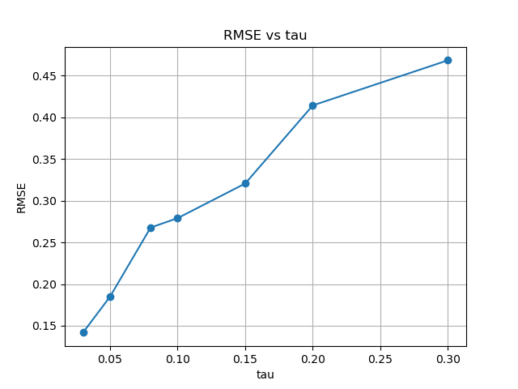
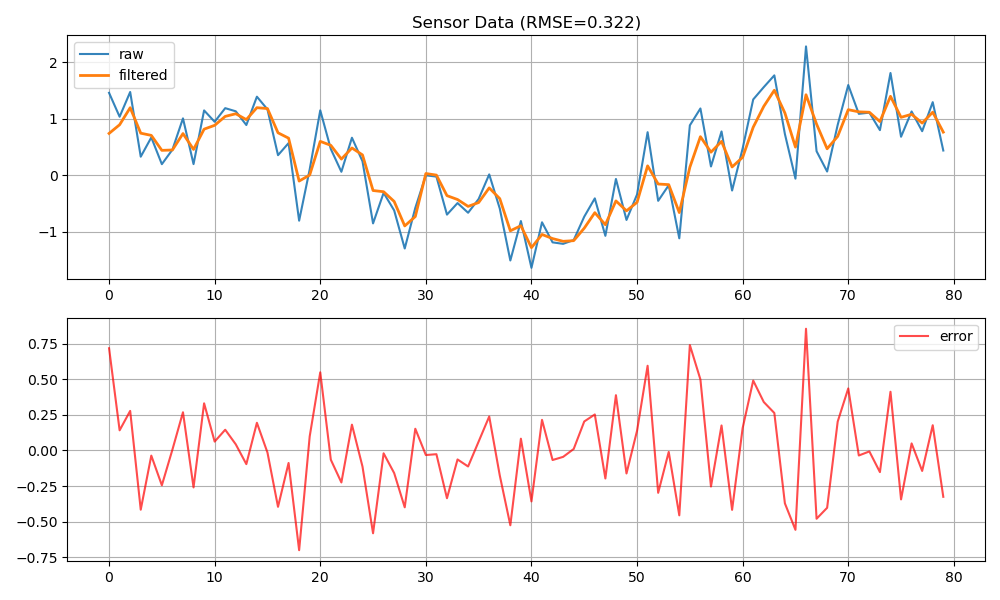
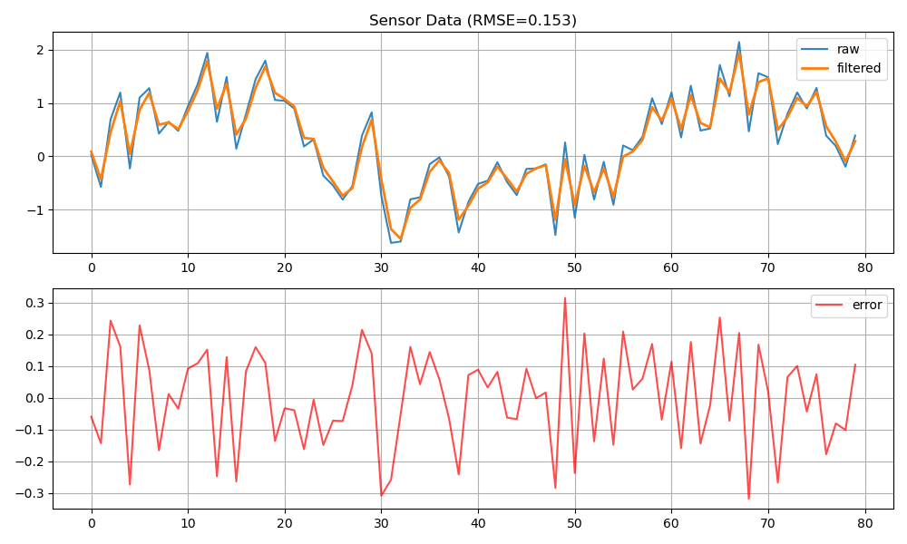
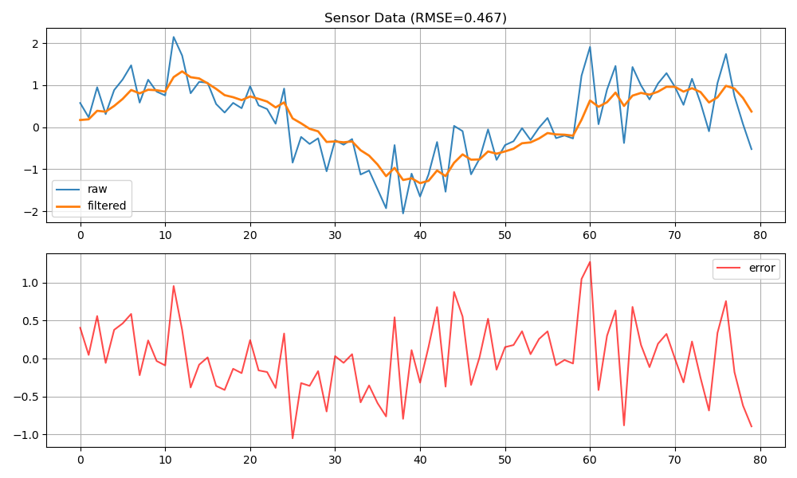

# ROS2 Sensor Pipeline

ROS2を用いて疑似センサーデータ生成・フィルタリング・可視化・評価までを行うパイプラインを構築しました。


## ■ 概要

ノイズを含む疑似センサーデータに対して一次遅れフィルタ（EMA）を適用し、  
指定したパラメータ(tau)により、RMSEがどう変化するか比較します。



---

## ■ ディレクトリ構成
```
ros2-sensor-pipeline/  
├ data/  
│ ├ result_tau_*.png         # 各tauの時系列グラフ  
│ ├ rmse_vs_tau.png          # 各tauによるRMSEの推移グラフ 
│ └ experiment_results.csv   # RMSE集計  
│  
├ src/  
│ ├ sensor_pipeline_cpp      # センサ & フィルタノード（C++）  
│ ├ sensor_pipeline_py       # 可視化ノード（Python）  
│ └ sensor_pipeline_launch   # launchファイル  
│  
├ sweep_tau.py               # パラメータスイープ実験  
├ plot_rmse.py               # RMSEグラフ生成  
└ run_all.py                 # 全自動実行スクリプト  
```
---

## ■ システム構成

```
SensorNode (C++)
↓
↓ 乱数ベースの疑似生データを通知
↓
FilterNode (C++)
↓
↓ EMAフィルタでフィルタリングしたデータを通知
↓
VisualizeNode (Python)
↓
CSV & グラフ出力 にて可視化
```

---

## ■ 実行方法

### 初回セットアップ
ROS2 workspace の `src` 配下に、本リポジトリ内 package へのシンボリックリンクを作成してください。
```
cd ~/work/ros2_ws/src

ln -s ~/work/ros2-sensor-pipeline/src/sensor_pipeline_cpp .
ln -s ~/work/ros2-sensor-pipeline/src/sensor_pipeline_launch .
ln -s ~/work/ros2-sensor-pipeline/src/sensor_pipeline_py .
```

### ROS2ビルド
```
cd ~/work/ros2_ws
colcon build --symlink-install --merge-install
source install/setup.bash
```

### 実験・評価・可視化（自動化）
```
cd ~/work/ros2-sensor-pipeline

python3 run_all.py
```
RMSE評価・CSV保存・グラフ生成までを自動実行します。

### 制約事項
CSV/画像出力パスを簡略化するため、  
本リポジトリを以下のパスへ clone する前提となっています。
```
~/work/ros2-sensor-pipeline
```

---

## ■ フィルタ概要

一次遅れフィルタ（Exponential Moving Average）  
filtered = alpha * raw + (1 - alpha) * prev_filtered

- パラメータ(tau)によりalphaが変化する
- tauが大きいほど、alphaが小さくなる
- alphaが小さくなるほど、過去のfiltered値を強く残すのでフィルタリングが強くなる

---

## ■ 実験内容

複数のtauで自動実行し、RMSEを比較：

```
TAUS = [0.03, 0.05, 0.08, 0.1, 0.15, 0.2, 0.3]
```

内容：  
- ROS2ノード起動  
- データ収集（raw / filtered）  
- RMSE計算  
- CSVへ保存  
- グラフ生成  

### ■ 出力結果  
- 時系列グラフ  
- raw（センサ値）  
- filtered（フィルタ後）  
- error（raw - filtered）  # 誤差算出

評価グラフ  
```
data/rmse_vs_tau.png  
```
👉 tauごとのRMSEを比較します

### ■ 結果と考察  
- 小さいtau  
→ 生のセンサーデータに近いまま通知する  
- 大きいtau  
→ より強いフィルターがかかる

### 時系列グラフ（tau 0.1の例）


### 比較例（tau 0.03と0.3の比較）



### ■ 工夫した点  
- パラメータスイープの自動化（sweep_tau.py）  
- 実験〜可視化の完全自動化（run_all.py）  
- 途中終了でも壊れないファイル保存（atomic save）    
- 初期不安定データの除外（warmup） 

### ■ 技術スタック  
- ROS2 Humble  
- C++（rclcpp）  
- Python（rclpy, matplotlib）  
- colcon

---

## ■ 環境  
- OS: Ubuntu 22.04
- ROS2: Humble
- Python: 3.10.12
- Compiler: g++ 11.4.0
